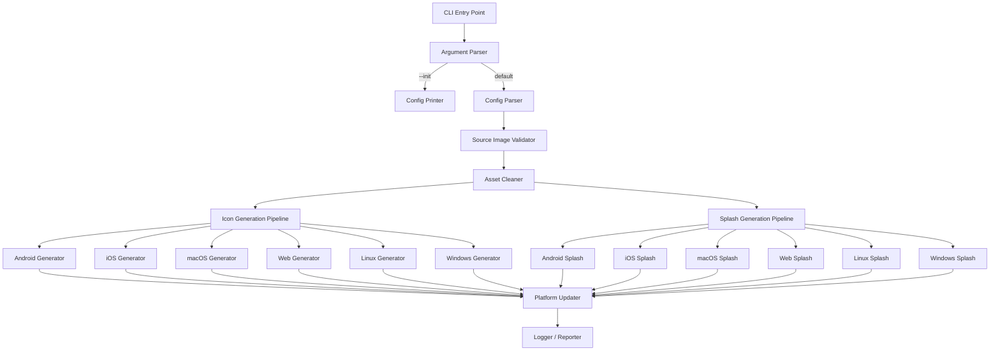
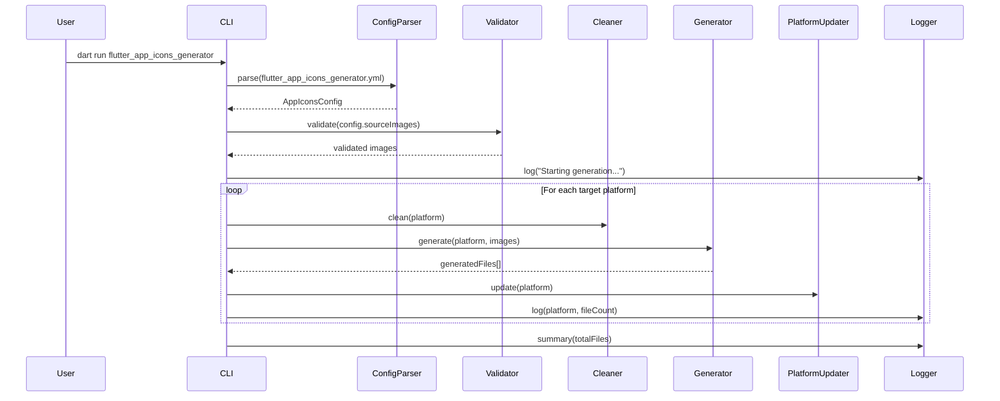
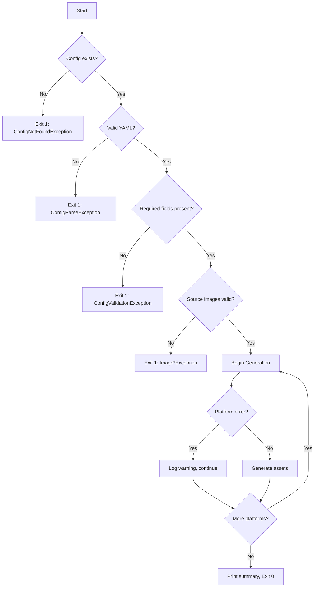

# Design Document: flutter-app-icons-generator

## Overview

`flutter_app_icons_generator` is a Dart CLI tool that generates platform-specific app icons and native splash screens for Flutter projects. It reads a `flutter_app_icons_generator.yml` configuration file and produces correctly sized, optimized, standards-compliant assets for iOS, Android, macOS, Linux, Windows, and Web.

The tool follows a pipeline architecture:

1. **Parse** the YAML configuration file
2. **Validate** source images (existence, dimensions, format)
3. **Clean** existing assets for targeted platforms
4. **Generate** platform-specific icon and splash assets
5. **Update** platform configuration files (manifests, plists, etc.)
6. **Report** progress and results to the user

### Key Design Decisions

- **`image` package (pub.dev)**: Uses the well-established `brendan-duncan/image` Dart library for all image decoding, resizing, alpha channel manipulation, and encoding. This is a pure Dart library with no native dependencies, ensuring cross-platform CLI compatibility.
- **`yaml` package**: Uses Dart's official `yaml` package for parsing YAML configuration files.
- **`args` package**: Uses Dart's official `args` package for CLI argument parsing.
- **`glados` package**: Uses the `glados` property-based testing library for Dart to validate correctness properties with generated inputs.
- **Feature-first architecture**: Each platform's generation logic is isolated in its own module, making the codebase easy to extend and maintain.
- **Pipeline pattern**: Processing follows a strict linear pipeline (parse → validate → clean → generate → update → report) with early exit on errors.
- **ICO encoding**: Uses the `image` library's built-in ICO encoding support for generating Windows icon files.

## Architecture



### Pipeline Sequence



### Project Directory Structure

```
flutter-app-icons-generator/
├── bin/
│   └── flutter_app_icons_generator.dart          # CLI entry point
├── lib/
│   ├── flutter_app_icons_generator.dart          # Public library barrel
│   └── src/
│       ├── cli/
│       │   ├── cli_runner.dart         # Argument parsing & orchestration
│       │   └── logger.dart             # Progress & error reporting
│       ├── config/
│       │   ├── config_model.dart       # Configuration data models
│       │   ├── config_parser.dart      # YAML parsing & validation
│       │   └── config_printer.dart     # YAML serialization
│       ├── core/
│       │   ├── image_processor.dart    # Image loading, resizing, alpha removal
│       │   ├── image_optimizer.dart    # Lossless compression
│       │   └── asset_cleaner.dart      # Stale asset removal
│       ├── platforms/
│       │   ├── android/
│       │   │   ├── android_icon_generator.dart
│       │   │   ├── android_splash_generator.dart
│       │   │   └── android_updater.dart
│       │   ├── ios/
│       │   │   ├── ios_icon_generator.dart
│       │   │   ├── ios_splash_generator.dart
│       │   │   └── ios_updater.dart
│       │   ├── macos/
│       │   │   ├── macos_icon_generator.dart
│       │   │   ├── macos_splash_generator.dart
│       │   │   └── macos_updater.dart
│       │   ├── web/
│       │   │   ├── web_icon_generator.dart
│       │   │   ├── web_splash_generator.dart
│       │   │   └── web_updater.dart
│       │   ├── linux/
│       │   │   ├── linux_icon_generator.dart
│       │   │   ├── linux_splash_generator.dart
│       │   │   └── linux_updater.dart
│       │   └── windows/
│       │       ├── windows_icon_generator.dart
│       │       ├── windows_splash_generator.dart
│       │       └── windows_updater.dart
│       └── shared/
│           ├── constants.dart          # Platform size constants
│           └── exceptions.dart         # Custom exception types
├── test/
│   ├── config/
│   │   ├── config_parser_test.dart
│   │   └── config_printer_test.dart
│   ├── core/
│   │   ├── image_processor_test.dart
│   │   └── asset_cleaner_test.dart
│   ├── platforms/
│   │   └── ... (per-platform tests)
│   └── property/
│       └── config_roundtrip_test.dart  # Property-based tests
├── pubspec.yaml
├── README.md
├── LICENSE
├── CHANGELOG.md
└── CONTRIBUTING.md
```

## Components and Interfaces

### 1. CLI Runner (`cli/cli_runner.dart`)

Orchestrates the entire execution pipeline.

```dart
abstract class CliRunner {
  /// Parses CLI arguments and dispatches to the appropriate command.
  Future<int> run(List<String> arguments);
}

class FlutterAppIconsRunner implements CliRunner {
  final ConfigParser configParser;
  final ConfigPrinter configPrinter;
  final ImageProcessor imageProcessor;
  final AssetCleaner assetCleaner;
  final Logger logger;
  final Map<Platform, IconGenerator> iconGenerators;
  final Map<Platform, SplashGenerator> splashGenerators;
  final Map<Platform, PlatformUpdater> platformUpdaters;

  Future<int> run(List<String> arguments);
}
```

### 2. Config Parser (`config/config_parser.dart`)

Reads and validates the YAML configuration file.

```dart
abstract class ConfigParser {
  /// Parses the flutter_app_icons_generator.yml file and returns a validated config.
  /// Throws [ConfigNotFoundException] if the file doesn't exist.
  /// Throws [ConfigParseException] if YAML is invalid.
  /// Throws [ConfigValidationException] if required fields are missing.
  AppIconsConfig parse(String projectRoot);
}
```

### 3. Config Printer (`config/config_printer.dart`)

Serializes configuration back to YAML format.

```dart
abstract class ConfigPrinter {
  /// Serializes a config to a YAML string with comments.
  String print(AppIconsConfig config);

  /// Generates a default config file with documentation comments.
  String printDefault();
}
```

### 4. Image Processor (`core/image_processor.dart`)

Handles image loading, validation, resizing, and alpha channel removal.

```dart
abstract class ImageProcessor {
  /// Loads and validates a source image.
  /// Throws [ImageNotFoundException] if file doesn't exist.
  /// Throws [ImageDimensionException] if too small.
  /// Throws [ImageFormatException] if unsupported format.
  SourceImage loadAndValidate(String path);

  /// Resizes an image to the target dimensions using Lanczos interpolation.
  Image resize(Image source, int width, int height);

  /// Removes alpha channel by compositing onto a white background.
  Image removeAlpha(Image source);

  /// Composites foreground onto background layer for adaptive icons.
  Image composite(Image foreground, Image background);
}
```

### 5. Image Optimizer (`core/image_optimizer.dart`)

Applies lossless compression to generated images.

```dart
abstract class ImageOptimizer {
  /// Encodes an image to PNG with maximum lossless compression.
  List<int> encodePng(Image image, {int compressionLevel = 6});

  /// Encodes an image to ICO format with embedded sizes.
  List<int> encodeIco(Image image, List<int> sizes);
}
```

### 6. Asset Cleaner (`core/asset_cleaner.dart`)

Removes existing assets before regeneration.

```dart
abstract class AssetCleaner {
  /// Cleans all existing icon and splash assets for a given platform.
  /// Returns the list of deleted file paths.
  List<String> clean(Platform platform, String projectRoot);
}
```

### 7. Icon Generator (per-platform interface)

Each platform implements this interface:

```dart
abstract class IconGenerator {
  /// Generates all icon assets for this platform.
  /// Returns a list of generated file paths.
  Future<List<String>> generate({
    required String projectRoot,
    required IconConfig iconConfig,
    required ImageProcessor imageProcessor,
    required ImageOptimizer optimizer,
  });
}
```

### 8. Splash Generator (per-platform interface)

```dart
abstract class SplashGenerator {
  /// Generates splash screen assets for this platform.
  /// Returns a list of generated file paths.
  Future<List<String>> generate({
    required String projectRoot,
    required SplashConfig splashConfig,
    required ImageProcessor imageProcessor,
    required ImageOptimizer optimizer,
  });
}
```

### 9. Platform Updater (per-platform interface)

```dart
abstract class PlatformUpdater {
  /// Updates platform config files to reference generated assets.
  Future<void> update(String projectRoot);
}
```

### 10. Logger (`cli/logger.dart`)

```dart
abstract class Logger {
  /// Logs a platform processing start message.
  void platformStart(Platform platform);

  /// Logs file generation details (verbose mode only).
  void fileGenerated(String path);

  /// Logs a platform completion with file count.
  void platformComplete(Platform platform, int fileCount);

  /// Logs the final summary.
  void summary(Map<Platform, int> results);

  /// Logs an error for a specific platform (non-fatal).
  void platformError(Platform platform, String error);

  /// Logs a fatal error and suggests resolution.
  void fatalError(String message);
}
```

## Data Models

### AppIconsConfig

The root configuration model parsed from `flutter_app_icons_generator.yml`.

```dart
class AppIconsConfig {
  /// Icon configuration (required: at least one source).
  final IconConfig icon;

  /// Splash configuration (optional).
  final SplashConfig? splash;

  /// Target platforms. Defaults to all supported platforms.
  final Set<Platform> platforms;

  const AppIconsConfig({
    required this.icon,
    this.splash,
    this.platforms = Platform.values,
  });
}
```

### IconConfig

```dart
class IconConfig {
  /// Combined image path (used when no separate layers).
  final String? imagePath;

  /// Foreground layer path (for adaptive icons).
  final String? foregroundPath;

  /// Background layer — either an image path or hex color.
  final BackgroundConfig? background;

  const IconConfig({
    this.imagePath,
    this.foregroundPath,
    this.background,
  });

  /// Returns true if this is an adaptive icon configuration.
  bool get isAdaptive => foregroundPath != null && background != null;
}
```

### BackgroundConfig

```dart
sealed class BackgroundConfig {}

class BackgroundImage extends BackgroundConfig {
  final String imagePath;
  BackgroundImage(this.imagePath);
}

class BackgroundColor extends BackgroundConfig {
  /// Hex color string, e.g. "#FFFFFF"
  final String hexColor;
  BackgroundColor(this.hexColor);
}
```

### SplashConfig

```dart
class SplashConfig {
  /// Path to the splash source image.
  final String imagePath;

  /// Optional background color for the splash screen.
  final String? backgroundColor;

  const SplashConfig({
    required this.imagePath,
    this.backgroundColor,
  });
}
```

### Platform Enum

```dart
enum Platform {
  android,
  ios,
  macos,
  web,
  linux,
  windows;
}
```

### SourceImage (validated, in-memory image wrapper)

```dart
class SourceImage {
  /// The decoded image data.
  final Image image;

  /// Original file path.
  final String path;

  /// Image width in pixels.
  int get width => image.width;

  /// Image height in pixels.
  int get height => image.height;

  /// Whether the image has an alpha channel.
  bool get hasAlpha => image.numChannels == 4;

  const SourceImage({required this.image, required this.path});
}
```

### Platform Size Constants

```dart
class AndroidSizes {
  static const Map<String, int> densityBuckets = {
    'mipmap-mdpi': 48,
    'mipmap-hdpi': 72,
    'mipmap-xhdpi': 96,
    'mipmap-xxhdpi': 144,
    'mipmap-xxxhdpi': 192,
  };

  // Adaptive icon foreground/background are 108dp (432px at xxxhdpi).
  static const Map<String, int> adaptiveSizes = {
    'mipmap-mdpi': 108,
    'mipmap-hdpi': 162,
    'mipmap-xhdpi': 216,
    'mipmap-xxhdpi': 324,
    'mipmap-xxxhdpi': 432,
  };
}

class IosSizes {
  static const int appStoreSize = 1024;
}

class MacosSizes {
  static const List<int> sizes = [16, 32, 64, 128, 256, 512, 1024];
}

class WebSizes {
  static const int faviconSize = 16;
  static const int pwaSmall = 192;
  static const int pwaLarge = 512;
}

class LinuxSizes {
  static const int iconSize = 512;
}

class WindowsSizes {
  static const List<int> icoSizes = [16, 32, 48, 64, 128, 256];
}
```

### YAML Configuration File Schema

```yaml
# flutter_app_icons_generator.yml

# Icon configuration (required)
icon:
  # Option A: Single combined image
  image: assets/icon.png

  # Option B: Adaptive icon layers (Android)
  # foreground: assets/icon_foreground.png
  # background: assets/icon_background.png    # image path
  # background: "#4CAF50"                     # or hex color

# Splash screen configuration (optional)
splash:
  image: assets/splash.png
  background_color: "#FFFFFF"

# Target platforms (optional, defaults to all)
platforms:
  - android
  - ios
  - macos
  - web
  - linux
  - windows
```

## Correctness Properties

_A property is a characteristic or behavior that should hold true across all valid executions of a system — essentially, a formal statement about what the system should do. Properties serve as the bridge between human-readable specifications and machine-verifiable correctness guarantees._

### Property 1: Configuration Round-Trip

_For any_ valid `AppIconsConfig` object (with any combination of icon paths, foreground/background layers, hex colors, splash config, and platform subsets), printing the config to YAML with the `ConfigPrinter` and then parsing the result with the `ConfigParser` SHALL produce a semantically equivalent `AppIconsConfig`.

**Validates: Requirements 1.2, 1.3, 1.4, 1.5, 2.4**

### Property 2: Image Dimension Validation

_For any_ image with width `w` and height `h`, the image validation function SHALL accept the image if and only if `w >= 1024` AND `h >= 1024`. Images below either threshold SHALL be rejected with an error containing the actual dimensions.

**Validates: Requirements 3.2, 3.5**

### Property 3: Alpha Channel Removal Produces Opaque Output

_For any_ RGBA image (with arbitrary pixel values including varying alpha), applying the alpha removal function (compositing onto a white background) SHALL produce an output image where every pixel has full opacity (alpha = 255) and the RGB values match the expected alpha-composite formula: `output_channel = (source_channel * source_alpha + 255 * (255 - source_alpha)) / 255`.

**Validates: Requirements 4.1, 4.2, 4.3, 4.4, 4.5, 8.3, 9.3**

### Property 4: Lossless PNG Compression Preserves Pixels

_For any_ image, encoding it to PNG with lossless compression and then decoding the resulting bytes SHALL produce an image that is pixel-identical to the input (same dimensions, same pixel values at every coordinate).

**Validates: Requirements 5.1**

### Property 5: Android Density Bucket Completeness

_For any_ valid source image and Android icon configuration (either adaptive or combined), the Android icon generator SHALL produce exactly one icon file per density bucket (mdpi, hdpi, xhdpi, xxhdpi, xxxhdpi), and each file's dimensions SHALL match the expected pixel size for that density (48, 72, 96, 144, 192 for standard icons).

**Validates: Requirements 7.3, 7.4, 7.5**

### Property 6: Resize Produces Exact Target Dimensions

_For any_ source image with dimensions >= 1024x1024 and any target size `(tw, th)` where `1 <= tw <= source_width` and `1 <= th <= source_height`, the resize function SHALL produce an output image with dimensions exactly equal to `(tw, th)`.

**Validates: Requirements 8.1, 9.1, 10.1, 10.2, 11.1, 12.1**

## Error Handling

### Error Strategy

The CLI uses a fail-fast approach for configuration and validation errors, and a continue-on-error approach for platform-specific generation errors:

| Error Type                   | Behavior                               | Exit Code         |
| ---------------------------- | -------------------------------------- | ----------------- |
| Config file not found        | Fatal, immediate exit                  | 1                 |
| Invalid YAML syntax          | Fatal, immediate exit with line number | 1                 |
| Missing required fields      | Fatal, immediate exit with field list  | 1                 |
| Source image not found       | Fatal, immediate exit with path        | 1                 |
| Image too small              | Fatal, immediate exit with dimensions  | 1                 |
| Unsupported image format     | Fatal, immediate exit with format info | 1                 |
| Platform generation failure  | Non-fatal, log error, continue         | 0 (with warnings) |
| File already exists (--init) | Fatal, immediate exit                  | 1                 |
| Platform config file missing | Non-fatal, skip platform update, warn  | 0 (with warnings) |

### Custom Exception Types

```dart
/// Base exception for all flutter_app_icons_generator errors.
sealed class AppIconsException implements Exception {
  String get message;
  int get exitCode => 1;
}

/// Config file not found at expected path.
class ConfigNotFoundException extends AppIconsException {
  final String expectedPath;
  String get message => 'Configuration file not found: $expectedPath';
}

/// YAML parsing failed.
class ConfigParseException extends AppIconsException {
  final String yamlError;
  final int? lineNumber;
  String get message => 'Invalid YAML at line $lineNumber: $yamlError';
}

/// Required config fields are missing.
class ConfigValidationException extends AppIconsException {
  final List<String> missingFields;
  String get message => 'Missing required fields: ${missingFields.join(", ")}';
}

/// Source image file not found.
class ImageNotFoundException extends AppIconsException {
  final String path;
  String get message => 'Image not found: $path';
}

/// Source image dimensions too small.
class ImageDimensionException extends AppIconsException {
  final int actualWidth;
  final int actualHeight;
  final int minRequired;
  String get message =>
      'Image dimensions ${actualWidth}x$actualHeight are below minimum ${minRequired}x$minRequired';
}

/// Unsupported image format.
class ImageFormatException extends AppIconsException {
  final String detectedFormat;
  String get message =>
      'Unsupported format "$detectedFormat". Supported: PNG, JPEG';
}

/// Config file already exists (--init conflict).
class ConfigExistsException extends AppIconsException {
  final String path;
  String get message => 'Config file already exists: $path';
}

/// Non-fatal platform generation error.
class PlatformGenerationException implements Exception {
  final Platform platform;
  final String error;
  String get message => '[$platform] Generation failed: $error';
}
```

### Error Flow



## Testing Strategy

### Testing Framework

- **Unit tests**: `package:test` — Dart's standard testing framework
- **Property-based tests**: `package:glados` — Property-based testing for Dart with automatic shrinking
- **Mocking**: `package:mockito` with `build_runner` for generating mocks of interfaces (file system, image processor)

### Test Categories

#### 1. Property-Based Tests (via `glados`)

Each correctness property maps to one property-based test, configured for minimum 100 iterations:

| Property                     | Test File                                  | What's Generated                |
| ---------------------------- | ------------------------------------------ | ------------------------------- |
| Config round-trip            | `test/property/config_roundtrip_test.dart` | Random `AppIconsConfig` objects |
| Dimension validation         | `test/property/image_validation_test.dart` | Random width/height pairs       |
| Alpha removal                | `test/property/alpha_removal_test.dart`    | Random RGBA pixel data          |
| PNG lossless compression     | `test/property/png_compression_test.dart`  | Random image pixel grids        |
| Android density completeness | `test/property/android_density_test.dart`  | Random source images            |
| Resize dimensions            | `test/property/resize_test.dart`           | Random source/target size pairs |

Each test is tagged with a comment referencing the design property:

```dart
// Feature: flutter-app-icons-generator, Property 1: Configuration Round-Trip
```

#### 2. Unit Tests (via `package:test`)

- **Config Parser**: Test specific YAML inputs, edge cases (missing fields, invalid syntax, defaults)
- **Config Printer**: Test default file generation, comment inclusion
- **Asset Cleaner**: Test correct files are deleted per platform (mock file system)
- **Platform Updaters**: Test XML/JSON/HTML modifications with sample files
- **Logger**: Test output formatting for normal and verbose modes
- **CLI Runner**: Test argument parsing, --init flag, --verbose flag

#### 3. Integration Tests

- End-to-end test with a fixture Flutter project structure
- Verify full pipeline: config → validate → clean → generate → update
- Verify generated files exist at correct paths with correct dimensions

### Test Configuration

```yaml
# In pubspec.yaml
dev_dependencies:
  test: ^1.25.0
  glados: ^1.1.1
  mockito: ^5.4.0
  build_runner: ^2.4.0
```

### Property Test Requirements

- Minimum **100 iterations** per property test (configured via `Glados` explore count)
- Each property test must reference its design document property in a comment tag
- Tag format: `// Feature: flutter-app-icons-generator, Property {N}: {title}`
- Custom `Arbitrary` instances for `AppIconsConfig`, `IconConfig`, `BackgroundConfig`, `SplashConfig`, and `Platform` enum subsets

### Test Execution

```bash
# Run all tests
dart test

# Run only property-based tests
dart test test/property/

# Run with verbose output
dart test --reporter expanded
```
